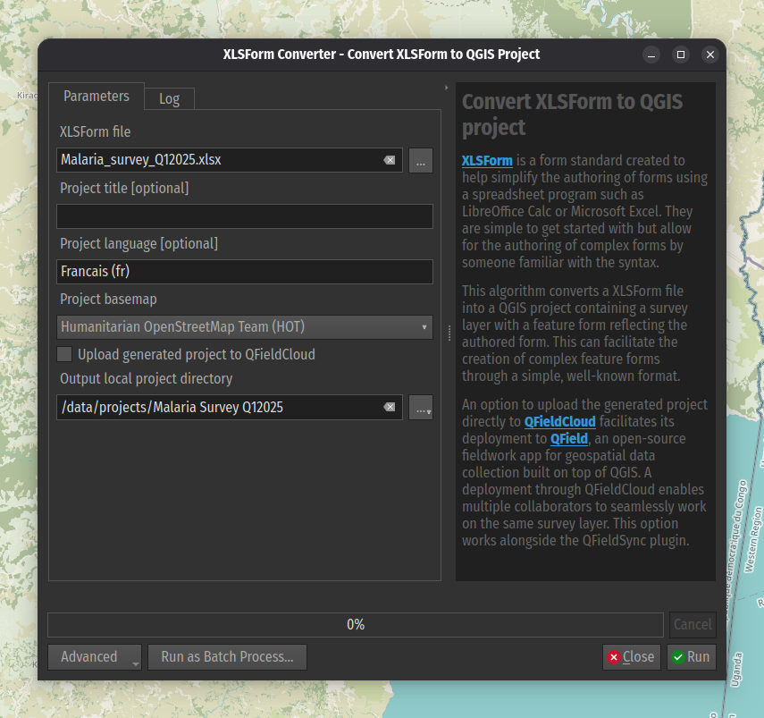

# XLSForm Converter

A QGIS plugin to convert XLSForm files into QGIS projects with pre-configured
survey forms. The convertion is done through an algorithm located under the
processing toolbox's XLSForm Converter group added by the plugin.

## Algorithm description

[XLSForm](https://xlsform.org/en/) is a form standard created to help simplify
the authoring of forms using a spreadsheet program such as LibreOffice Calc
or Microsoft Excel. They are simple to get started with but allow for the
authoring of complex forms by someone familiar with the syntax.

The plugin algorithm converts a XLSForm file into a QGIS project containing
a survey layer with a feature form reflecting the authored form. This can
facilitate the creation of complex feature forms through a simple,
well-known format.

An option to upload the generated project directly to [QFieldCloud](https://qfield.cloud)
facilitates its deployment to [QField](https://qfield.org/), an open-source
fieldwork app for geospatial data collection built on top of QGIS. A deployment
through QFieldCloud enables multiple collaborators to seamlessly work on the
same survey layer. This option works alongside the QFieldSync plugin.

## Local development of this plugin

To develop locally this plugin, checkout [`XLSFormConverter`](https://github.com/opengisch/XLSFormConverter/) and  [`xlsform2qgis`](https://github.com/opengisch/xlsform2qgis/) repositories.

1. Checkout the [`XLSFormConverter`](https://github.com/opengisch/XLSFormConverter/) by executing `git clone git@github.com:opengisch/XLSFormConverter.git`.

2. Checkout the [`xlsform2qgis`](https://github.com/opengisch/xlsform2qgis/) by following the `README.md` instructions from the respective repository. Ensure you install `xlsform2qgis` as locally editable module, as per documentation.

